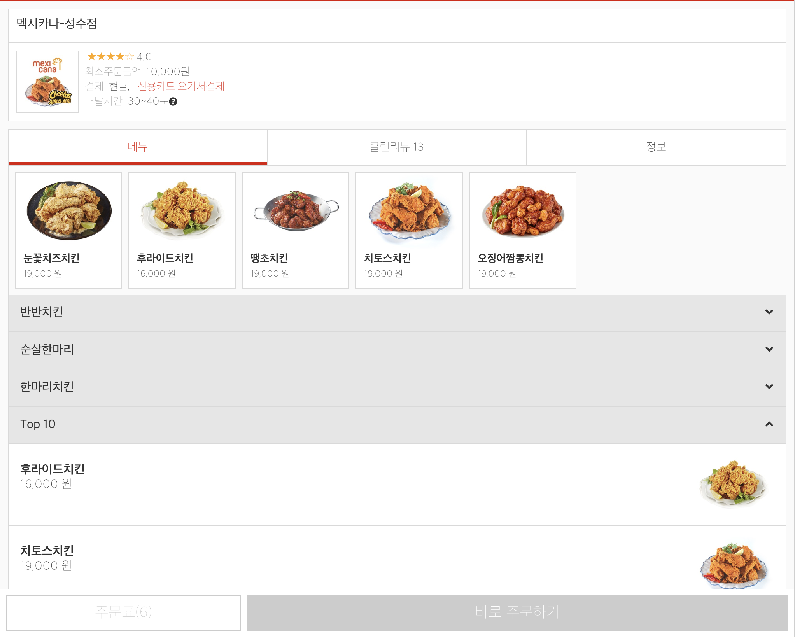

# Project 'Jogiyo'

## 요기요 카피 프로젝트

### [조기요 웹페이지](https://jogiyo2.netlify.com) 

#### 개요

패스트캠퍼스 프론트엔드 개발 스쿨 11기 수료 프로젝트로써, 요기요의 기능을 비롯한 모든 것을 따라한 프로젝트입니다.


```
주요 기능
1. 내 위치 확인 기능
2. 내 위치 기반 주변 음식점 목록 불러오기
3. 음식점 메뉴 보기, 리뷰 보기
4. 장바구니 담아두기 기능
5. 주문 기능
```

#### 활용 기술

- React
- React-router
- axios
- Scss
- HTML
- CSS
- webpack
- netlify

#### 서비스 환경

- 반응형 및 터치 이벤트 지원으로 모바일 환경 대응
- 크로스 브라우징

---

##### 완성된 페이지


